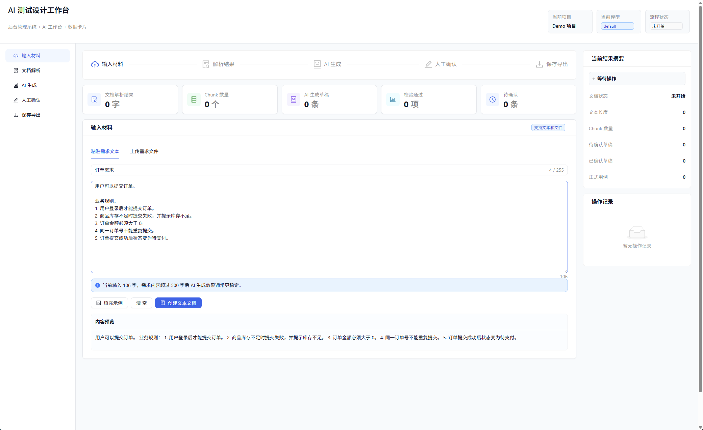

# AI TestOps

[English](README.md) | [中文](README_CN.md)

---

AI TestOps 是一个面向 **AI 辅助测试设计** 的全链路 Spring Boot 3 + React 演示项目。系统将需求文档接入、文档解析、AI 需求抽取、测试用例草稿生成、自动校验、人工评审确认和用例导出串联成一条轻量闭环，适合验证 AI 辅助测试设计、需求到用例生成、Prompt 版本管理和测试资产沉淀等场景。


后端基于 **Java 17 + Spring Boot 3.5.9**，使用 **MyBatis-Plus** 持久化、**Apache Tika 3.2.3** 文档解析，并提供 **OpenAI 兼容的 REST Client** 适配大模型接口（兼容 OpenAI、通义千问 Qwen、DeepSeek 等支持 `/v1/chat/completions` 的服务）。接口文档集成 **Knife4j**。

前端由 **React 18 + TypeScript + Ant Design 5 + Vite** 构建，生产构建产物输出到 `src/main/resources/static`，由 Spring Boot 统一托管。

## 功能特性

- **文档接入与解析**：支持文本录入和 `md/txt/pdf/doc/docx/xls/xlsx/ppt/pptx` 文件上传，通过 Apache Tika 解析并分块。
- **AI 需求抽取**：从需求文档中提取结构化需求（业务规则、API 列表、字段约束、异常场景、风险），支持 MOCK 和真实大模型联调。
- **测试用例生成**：基于需求抽取结果生成测试用例草稿，覆盖正常、异常、边界场景。
- **Prompt 版本管理**：Prompt 模板支持多版本管理，可按版本启用/停用。
- **AI 校验**：对 AI 生成内容自动校验，追踪模板版本维度的通过/失败率。
- **人工评审**：支持草稿编辑、确认、驳回和批量确认，保留完整评审记录。
- **测试资产导出**：支持正式测试用例查询，并导出 JSON 或 Excel。

## 技术栈

| 层级      | 技术                                           |
| --------- | ----------------------------------------------- |
| 后端      | Java 17, Spring Boot 3.5.9, Maven               |
| ORM       | MyBatis-Plus 3.5.9                              |
| 数据库    | MariaDB 10.11+（测试用 H2）                      |
| 文档解析  | Apache Tika 3.2.3                                |
| AI 客户端 | OpenAI 兼容 HTTP（`/v1/chat/completions`）        |
| 接口文档  | Knife4j 4.4.0（Swagger UI）                     |
| 前端      | React 18, TypeScript, Ant Design 5, Vite         |

## 快速入口

- 前端页面：`http://localhost:8080/`
- Knife4j 接口文档：`http://localhost:8080/doc.html`
- 启动运行说明：[docs/启动运行说明.md](docs/启动运行说明.md)
- 真实大模型联调：[docs/真实大模型联调.md](docs/真实大模型联调.md)
- Prompt 版本化与质量闭环：[docs/Prompt版本化与质量闭环.md](docs/Prompt版本化与质量闭环.md)

## 环境要求

- **JDK 17+** — 项目编译目标为 Java 17。
- **MariaDB 10.11+** — 需要提前建库建表，建表脚本见 `docs/sql/ai_testops_mariadb_schema.sql`。
- **Maven** — Windows 可直接使用项目内的 `mvnw.cmd`，不要求提前安装。
- **Node.js + npm** — 仅在开发或重新构建前端时需要。

## 配置

所有配置统一放在项目根目录 `.env`，通过 `java-dotenv` 加载。首次使用：

```powershell
Copy-Item docs\.env.example .env
```

### 数据库

```properties
DB_URL=jdbc:mariadb://your-host:3306/ai_testops?useUnicode=true&characterEncoding=utf8&serverTimezone=Asia/Shanghai
DB_USERNAME=your_user
DB_PASSWORD=your_password
```

### AI / 大模型

```properties
# MOCK 模式 — 无需 API Key，返回模拟数据，适合本地联调
AI_PROVIDER=MOCK

# 真实 OpenAI-compatible API（OpenAI、通义千问 Qwen、DeepSeek 等）
AI_PROVIDER=OPENAI_COMPATIBLE
AI_API_BASE=https://api.openai.com
AI_API_KEY=sk-...
AI_MODEL_NAME=gpt-4.1-mini
AI_TEMPERATURE=0.2
AI_MAX_TOKENS=4096
AI_JSON_MODE=true
```

> `AI_JSON_MODE=true` 会向模型发送 `response_format: {type: "json_object"}`，确保输出为合法 JSON。该模式兼容大多数 AI 供应商（OpenAI、Qwen、DeepSeek）。如果供应商不支持 `json_object`，请设为 `false`。

### 服务与上传

```properties
SERVER_PORT=8080
AI_TESTOPS_UPLOAD_DIR=./data/uploads
UPLOAD_MAX_FILE_SIZE=50MB
```

## 启动方式

### 启动后端和已构建前端（单命令）

```powershell
.\mvnw.cmd spring-boot:run
```

Spring Boot 会启动后端 API，并托管 `src/main/resources/static` 下的前端静态页面。

### 前端开发联调

仅在修改前端源码时执行。Vite 开发服务器默认运行在 `http://localhost:5173/`，并代理 API 请求到后端 `http://localhost:8080`。

```powershell
cd frontend
npm install
npm run dev
```

> 项目根目录**没有** `package.json`，不要在根目录执行 npm 命令。

### 更换端口

```powershell
$env:SERVER_PORT=8081
.\mvnw.cmd spring-boot:run
```

## 构建方式

### 构建后端 Jar

```powershell
.\mvnw.cmd clean package
java -jar target/ai-testops-0.0.1-SNAPSHOT.jar
```

### 构建后端 Jar + 前端静态资源

```powershell
cd frontend
npm install && npm run build
cd ..
.\mvnw.cmd clean package
java -jar target/ai-testops-0.0.1-SNAPSHOT.jar
```

前端构建产物输出到 `src/main/resources/static`（由 `frontend/vite.config.ts` 配置）。

## 验证

```powershell
# 后端测试（JUnit 5 + H2 内存数据库）
.\mvnw.cmd test

# 前端生产构建
cd frontend
npm run build
```

## 项目结构

```
├── src/main/java/.../aitestops/
│   ├── ai/             # AI 客户端、服务、控制器、Prompt 模板
│   ├── document/       # 文档上传、解析、分块
│   ├── testcase/       # 测试用例草稿、正式用例管理
│   ├── review/         # 人工评审记录
│   ├── export/         # JSON / Excel 导出
│   └── common/         # 配置、枚举、异常、工具类
├── src/main/resources/static/   # 前端构建产物
├── frontend/           # React + Vite 源码
├── docs/               # 文档、SQL 脚本、环境变量示例
└── data/uploads/       # 上传文件存储
```

## 常用接口

| 接口                                                | 说明                         |
| --------------------------------------------------- | ---------------------------- |
| `POST /api/ai-testops/documents/text`               | 创建文本文档                  |
| `POST /api/ai-testops/documents/upload`             | 上传文件                      |
| `POST /api/ai-testops/documents/{id}/parse`         | 解析并分块文档                |
| `POST /api/ai-testops/ai/requirements/extract`      | AI 抽取结构化需求              |
| `POST /api/ai-testops/testcases/generate`           | 生成测试用例草稿               |
| `GET  /api/ai-testops/testcases/drafts`             | 查询草稿列表                  |
| `POST /api/ai-testops/testcases/drafts/{id}/approve` | 确认草稿                     |
| `GET  /api/ai-testops/export/testcases/json`        | 导出 JSON 格式测试用例         |
| `GET  /api/ai-testops/export/testcases/excel`       | 导出 Excel 格式测试用例        |

完整接口列表见 [docs/启动运行说明.md](docs/启动运行说明.md) §7。

## 常见问题

- **8080 端口被占用**：停止占用端口的进程，或设置 `$env:SERVER_PORT=8081` 后重启。
- **数据库连接失败**：检查 `.env` 中 `DB_URL/DB_USERNAME/DB_PASSWORD`，确认 MariaDB 已运行且已建表。
- **AI 返回 MOCK 内容**：默认 `AI_PROVIDER=MOCK`。配置 `AI_PROVIDER/AI_API_BASE/AI_API_KEY/AI_MODEL_NAME` 后重启即可使用真实模型。
- **AI 返回 400 关于 `response_format`**：部分供应商只支持 `json_object` 而不支持 `json_schema`。本项目已改为默认使用 `json_object`（当 `AI_JSON_MODE=true` 时）。如果供应商不支持 `json_object`，请将 `AI_JSON_MODE=false`。
