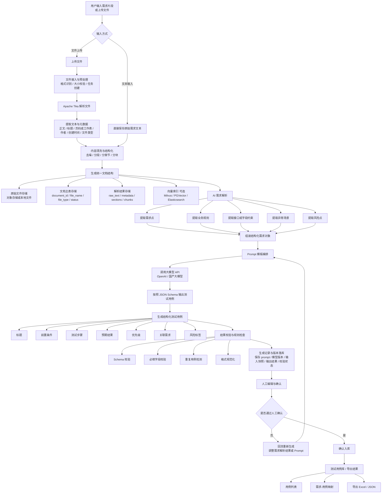
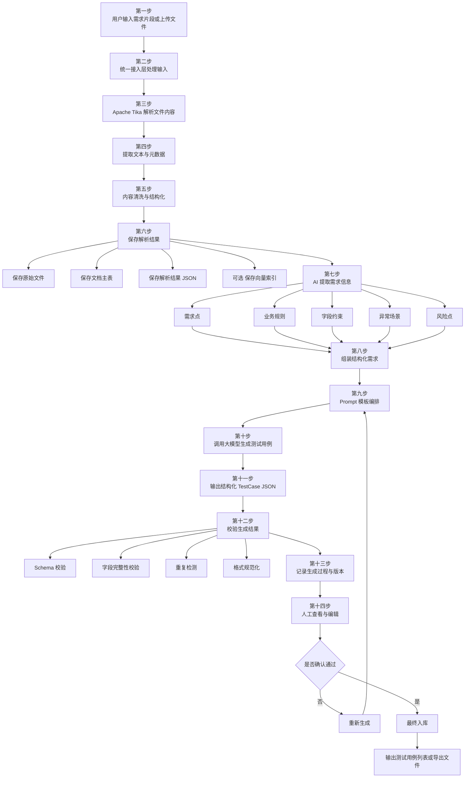

**Mermaid 格式流程图**，内容按照 Demo 的实现路径来设计，适合后面一步一步落地。

总流程：


---

## Mermaid 总流程图



---

## 分阶段实现版 Mermaid



---

## 我建议你配套使用的结构化对象

因为是一步一步实现，所以 Mermaid 图之外，同步固定 3 个核心对象。

### 1. 文档解析结果对象

```json
{
  "document_id": "doc_001",
  "file_name": "需求说明.pdf",
  "file_type": "pdf",
  "raw_text": "原始提取文本",
  "metadata": {
    "author": "xxx",
    "created_at": "2026-04-30",
    "page_count": 10
  },
  "sections": [
    {
      "title": "模块A",
      "content": "章节内容"
    }
  ],
  "chunks": [
    {
      "chunk_id": "chunk_001",
      "text": "分块内容"
    }
  ]
}
```

### 2. 需求提取结果对象

```json
{
  "requirements": [
    "用户可以提交订单"
  ],
  "business_rules": [
    "订单金额必须大于0"
  ],
  "api_list": [
    "/api/order/create"
  ],
  "field_constraints": [
    "手机号必须11位"
  ],
  "exception_cases": [
    "库存不足时提交失败"
  ],
  "risks": [
    "重复提交订单"
  ]
}
```

### 3. 测试用例对象

```json
{
  "case_id": "TC_001",
  "title": "正常提交订单",
  "preconditions": [
    "用户已登录",
    "商品库存充足"
  ],
  "steps": [
    "进入下单页面",
    "填写订单信息",
    "点击提交"
  ],
  "expected_result": "订单提交成功",
  "priority": "P1",
  "requirement_refs": [
    "REQ_001"
  ],
  "risk_tags": [
    "核心链路"
  ]
}
```

---

## 如果是按开发顺序做，这样拆任务

### 第一阶段

先做：

* 输入需求文本
* 上传文件
* Tika 解析
* 解析结果存储

### 第二阶段

再做：

* AI 提取需求点
* 输出结构化需求 JSON

### 第三阶段

再做：

* Prompt 模板
* 调用模型
* 生成测试用例 JSON

### 第四阶段

最后做：

* 校验
* 生成记录落库
* 人工编辑确认
* 导出结果

