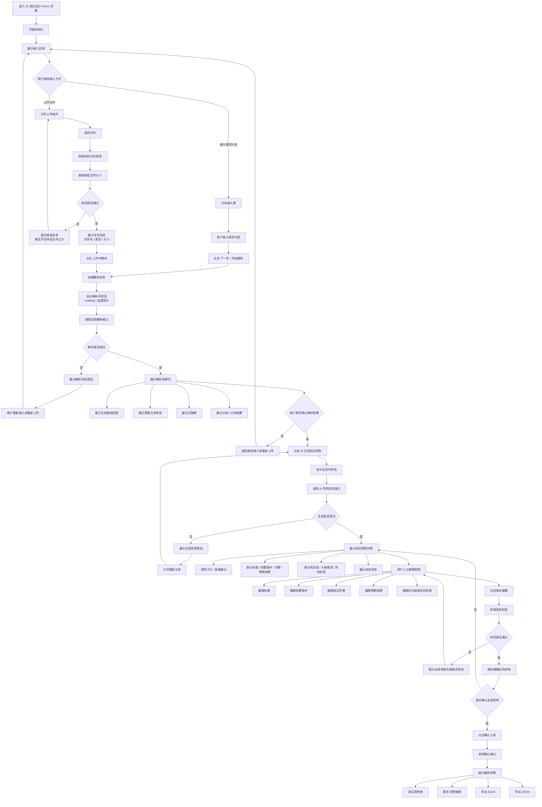
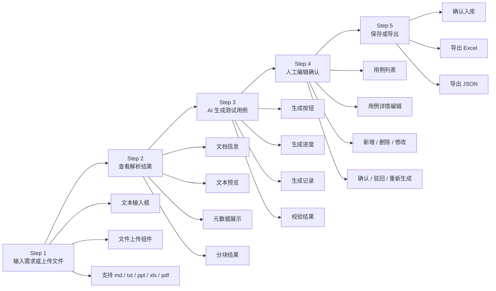
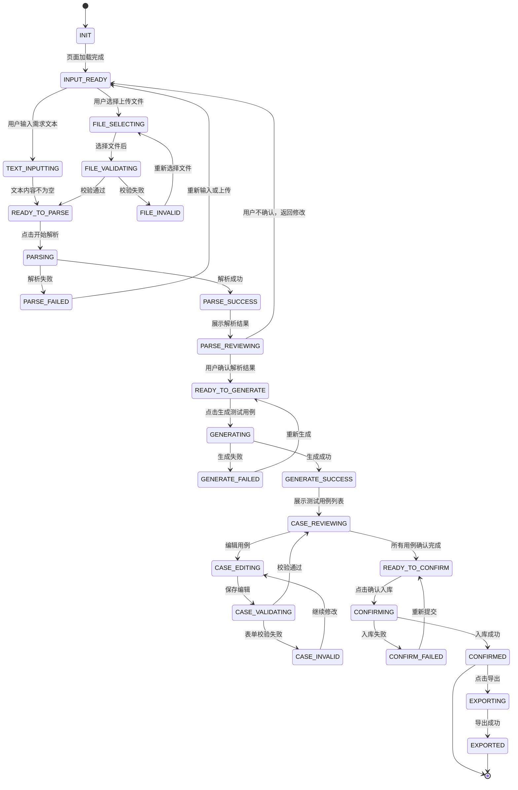
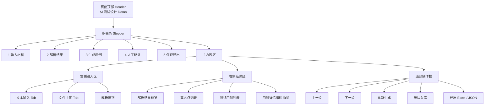

**前端页面交互流程图**

> 用户输入需求片段 / 上传文件 → 解析 → 查看解析结果 → AI 生成测试用例 → 校验 → 人工编辑确认 → 保存 / 导出

核心做成 **一个主页面 + 多步骤流程组件** 就够了

---

# 一、前端页面交互总流程图



---

# 二、推荐页面结构流程图

页面分成 5 个步骤。



---

# 三、页面状态流转图

根据这个设计页面的 `status` 状态。



---

# 四、单页面 UI 交互布局建议

页面设计：



---

# 五、建议前端组件拆分

用 React，都可以按这个组件结构拆。

```mermaid
flowchart TD

    A[AITestDesignPage]

    A --> B[StepHeader<br/>步骤条组件]
    A --> C[InputPanel<br/>输入面板]
    A --> D[ParseResultPanel<br/>解析结果面板]
    A --> E[GenerationPanel<br/>AI 生成面板]
    A --> F[TestCaseReviewPanel<br/>用例确认面板]
    A --> G[FooterActions<br/>底部操作栏]

    C --> C1[RequirementTextInput]
    C --> C2[FileUploadBox]
    C --> C3[FileInfoCard]

    D --> D1[DocumentInfoCard]
    D --> D2[MetadataViewer]
    D --> D3[RawTextPreview]
    D --> D4[ChunkList]

    E --> E1[GenerateButton]
    E --> E2[GenerationStatus]
    E --> E3[ValidationResult]

    F --> F1[TestCaseTable]
    F --> F2[TestCaseDetailDrawer]
    F --> F3[TestCaseStepEditor]
    F --> F4[RiskTagSelector]
    F --> F5[RequirementMappingViewer]

    G --> G1[PrevButton]
    G --> G2[NextButton]
    G --> G3[RegenerateButton]
    G --> G4[ConfirmButton]
    G --> G5[ExportButton]
```



---

# 六、核心交互动作设计

按下面这几个按钮实现。

| 操作       | 前端行为                            | 后端接口                                   |
| -------- | ------------------------------- | -------------------------------------- |
| 输入需求文本   | 保存到页面状态                         | 暂不请求                                   |
| 上传文件     | 前端校验格式和大小                       | `/api/files/upload`                    |
| 开始解析     | 显示解析中                           | `/api/documents/parse`                 |
| 查看解析结果   | 渲染 raw_text、metadata、chunks     | `/api/documents/{document_id}`         |
| 确认解析结果   | 进入生成步骤                          | `/api/documents/{document_id}/confirm` |
| 生成测试用例   | 显示生成中                           | `/api/testcases/generate`              |
| 重新生成     | 带上 document_id 和 prompt_version | `/api/testcases/regenerate`            |
| 编辑用例     | 打开编辑抽屉                          | 前端本地状态                                 |
| 保存编辑     | 校验后提交                           | `/api/testcases/{case_id}`             |
| 确认入库     | 批量确认                            | `/api/testcases/confirm`               |
| 导出 Excel | 下载文件                            | `/api/testcases/export/excel`          |
| 导出 JSON  | 下载文件                            | `/api/testcases/export/json`           |

---

# 七、推荐页面数据状态

前端页面可以维护这些状态。

```ts
type PageStatus =
  | "INIT"
  | "INPUT_READY"
  | "PARSING"
  | "PARSE_SUCCESS"
  | "PARSE_FAILED"
  | "GENERATING"
  | "GENERATE_SUCCESS"
  | "GENERATE_FAILED"
  | "CASE_REVIEWING"
  | "CASE_EDITING"
  | "CONFIRMING"
  | "CONFIRMED"
  | "EXPORTING"
  | "EXPORTED";
```

页面核心数据可以这样设计：

```ts
interface AITestDesignPageState {
  currentStep: number;
  pageStatus: PageStatus;

  inputMode: "TEXT" | "FILE";

  requirementText?: string;

  uploadedFile?: {
    fileName: string;
    fileType: string;
    fileSize: number;
    filePath?: string;
    fileHash?: string;
  };

  document?: {
    documentId: string;
    rawText: string;
    metadata: Record<string, any>;
    sections: DocumentSection[];
    chunks: DocumentChunk[];
    parseStatus: "PENDING" | "PROCESSING" | "SUCCESS" | "FAILED";
  };

  generation?: {
    generationId: string;
    modelName: string;
    promptVersion: string;
    status: "PENDING" | "SUCCESS" | "FAILED";
    validationResult?: ValidationResult;
  };

  testCases: TestCase[];

  selectedCaseId?: string;
}
```

---

# 八、最适合 Demo 的页面流程

Demo 不建议一开始做很多页面。
推荐就做一个页面，按步骤切换区域：

```text
AI 测试设计 Demo 页面
├── 顶部：标题 + 步骤条
├── Step 1：输入需求 / 上传文件
├── Step 2：解析结果预览
├── Step 3：AI 生成测试用例
├── Step 4：人工编辑确认
└── Step 5：保存 / 导出
```

这样最容易实现，也最适合演示。

核心闭环是：

```text
输入材料
  ↓
解析材料
  ↓
生成用例
  ↓
人工编辑
  ↓
确认入库
  ↓
导出结果
```


