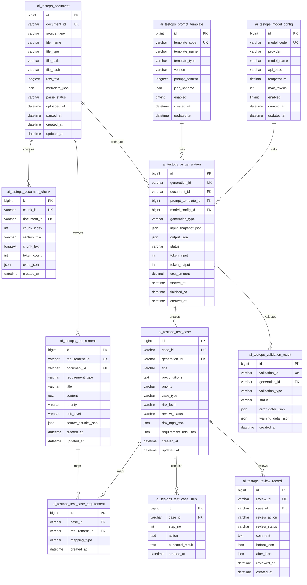

 **AI 测试设计 Demo** 的数据库存储 ER 设计。
当前功能范围来设计：**需求输入 / 文件解析 / AI 需求解析 / 用例生成 / 结果校验 / 人工确认 / 生成记录追溯**。

数据库建议命名：

```sql
ai_testops
```

表名前缀建议：

```sql
ai_testops_
```

---

# 一、核心 ER 关系图 Mermaid

可以直接复制到 Mermaid 渲染器中使用。



---

# 二、表设计说明

## 1. 文档主表：`ai_testops_document`

用于存储用户输入的需求文本或上传文件的基础信息。

### 作用

保存：

* 用户输入的需求片段
* 上传文件信息
* Tika 解析后的原始文本
* 文件元数据
* 解析状态

### 推荐字段

| 字段名           | 类型       | 说明                                    |
| ------------- | -------- | ------------------------------------- |
| id            | bigint   | 主键                                    |
| document_id   | varchar  | 文档业务 ID，例如 `DOC_20260502_001`         |
| source_type   | varchar  | 输入来源：`TEXT` / `FILE`                  |
| file_name     | varchar  | 文件名                                   |
| file_type     | varchar  | 文件类型：md、txt、pdf、ppt、xls               |
| file_path     | varchar  | 原始文件存储路径                              |
| file_hash     | varchar  | 文件 hash，用于去重                          |
| raw_text      | longtext | Tika 解析后的完整文本                         |
| metadata_json | json     | Tika 提取的元数据                           |
| parse_status  | varchar  | 解析状态：`PENDING` / `SUCCESS` / `FAILED` |
| uploaded_at   | datetime | 上传时间                                  |
| parsed_at     | datetime | 解析完成时间                                |
| created_at    | datetime | 创建时间                                  |
| updated_at    | datetime | 更新时间                                  |

---

## 2. 文档分块表：`ai_testops_document_chunk`

用于存储解析后的文档分块内容。

### 为什么需要分块？

因为大模型不能一次性处理无限长文本。
所以需要把文档按章节、段落或 token 长度切成多个 chunk。

### 作用

保存：

* 文档分段
* 文档章节
* chunk 文本
* 后续 RAG / 向量检索的基础数据

### 推荐字段

| 字段名           | 类型       | 说明         |
| ------------- | -------- | ---------- |
| id            | bigint   | 主键         |
| chunk_id      | varchar  | 分块 ID      |
| document_id   | varchar  | 关联文档 ID    |
| chunk_index   | int      | 第几个分块      |
| section_title | varchar  | 所属章节标题     |
| chunk_text    | longtext | 分块文本       |
| token_count   | int      | 估算 token 数 |
| extra_json    | json     | 扩展信息       |
| created_at    | datetime | 创建时间       |

---

## 3. 需求提取表：`ai_testops_requirement`

用于存储 AI 从文档中抽取出的结构化需求信息。

### 作用

保存 AI 提取出的：

* 需求点
* 业务规则
* 字段约束
* 接口约束
* 异常场景
* 风险点

### 推荐字段

| 字段名                | 类型       | 说明                                                              |
| ------------------ | -------- | --------------------------------------------------------------- |
| id                 | bigint   | 主键                                                              |
| requirement_id     | varchar  | 需求 ID，例如 `REQ_001`                                              |
| document_id        | varchar  | 来源文档 ID                                                         |
| requirement_type   | varchar  | 类型：`FUNCTION` / `RULE` / `API` / `FIELD` / `EXCEPTION` / `RISK` |
| title              | varchar  | 需求标题                                                            |
| content            | text     | 需求内容                                                            |
| priority           | varchar  | 优先级：P0 / P1 / P2                                                |
| risk_level         | varchar  | 风险等级：HIGH / MEDIUM / LOW                                        |
| source_chunks_json | json     | 来源 chunk ID 列表                                                  |
| created_at         | datetime | 创建时间                                                            |
| updated_at         | datetime | 更新时间                                                            |

---

## 4. Prompt 模板表：`ai_testops_prompt_template`

用于管理不同阶段的大模型 Prompt。

### 作用

保存：

* 需求解析 Prompt
* 测试用例生成 Prompt
* 结果校验 Prompt
* Prompt 版本
* JSON Schema 输出约束

### 推荐字段

| 字段名            | 类型       | 说明                                                             |
| -------------- | -------- | -------------------------------------------------------------- |
| id             | bigint   | 主键                                                             |
| template_code  | varchar  | 模板编码，例如 `TEST_CASE_GENERATE`                                   |
| template_name  | varchar  | 模板名称                                                           |
| template_type  | varchar  | 类型：`REQUIREMENT_EXTRACT` / `TEST_CASE_GENERATE` / `VALIDATION` |
| version        | varchar  | 版本号，例如 `v1.0.0`                                                |
| prompt_content | longtext | Prompt 内容                                                      |
| json_schema    | json     | 输出 JSON Schema                                                 |
| enabled        | tinyint  | 是否启用                                                           |
| created_at     | datetime | 创建时间                                                           |
| updated_at     | datetime | 更新时间                                                           |

---

## 5. 模型配置表：`ai_testops_model_config`

用于管理 OpenAI 或国产大模型 API 配置。

### 作用

保存：

* 模型供应商
* 模型名称
* API 地址
* 温度参数
* 最大 token 数
* 是否启用

### 推荐字段

| 字段名         | 类型       | 说明                                              |
| ----------- | -------- | ----------------------------------------------- |
| id          | bigint   | 主键                                              |
| model_code  | varchar  | 模型编码                                            |
| provider    | varchar  | 供应商：`OPENAI` / `QWEN` / `DEEPSEEK` / `MOONSHOT` |
| model_name  | varchar  | 模型名称                                            |
| api_base    | varchar  | API 地址                                          |
| temperature | decimal  | 生成温度                                            |
| max_tokens  | int      | 最大输出 token                                      |
| enabled     | tinyint  | 是否启用                                            |
| created_at  | datetime | 创建时间                                            |
| updated_at  | datetime | 更新时间                                            |

---

## 6. AI 生成记录表：`ai_testops_ai_generation`

这是整个系统最重要的审计表。

### 作用

每次调用 AI 都要记录：

* 输入是什么
* 用了哪个 Prompt
* 用了哪个模型
* 输出了什么
* 是否成功
* token 消耗
* 生成耗时
* 生成结果版本

### 推荐字段

| 字段名                 | 类型       | 说明                                              |
| ------------------- | -------- | ----------------------------------------------- |
| id                  | bigint   | 主键                                              |
| generation_id       | varchar  | 生成记录 ID                                         |
| document_id         | varchar  | 来源文档 ID                                         |
| prompt_template_id  | bigint   | 使用的 Prompt 模板                                   |
| model_config_id     | bigint   | 使用的模型配置                                         |
| generation_type     | varchar  | 类型：`REQUIREMENT_EXTRACT` / `TEST_CASE_GENERATE` |
| input_snapshot_json | json     | 输入快照                                            |
| output_json         | json     | AI 原始输出                                         |
| status              | varchar  | 状态：`SUCCESS` / `FAILED`                         |
| token_input         | int      | 输入 token 数                                      |
| token_output        | int      | 输出 token 数                                      |
| cost_amount         | decimal  | 预估成本                                            |
| started_at          | datetime | 开始时间                                            |
| finished_at         | datetime | 结束时间                                            |
| created_at          | datetime | 创建时间                                            |

---

## 7. 测试用例主表：`ai_testops_test_case`

用于保存最终生成的测试用例主信息。

### 作用

保存：

* 用例标题
* 前置条件
* 优先级
* 风险等级
* 评审状态
* 来源 generation_id

### 推荐字段

| 字段名                   | 类型       | 说明                                         |
| --------------------- | -------- | ------------------------------------------ |
| id                    | bigint   | 主键                                         |
| case_id               | varchar  | 用例 ID，例如 `TC_001`                          |
| generation_id         | varchar  | 来源 AI 生成记录 ID                              |
| title                 | varchar  | 用例标题                                       |
| preconditions         | text     | 前置条件                                       |
| priority              | varchar  | 优先级                                        |
| case_type             | varchar  | 类型：正常场景 / 异常场景 / 边界场景                      |
| risk_level            | varchar  | 风险等级                                       |
| review_status         | varchar  | 人工确认状态：`PENDING` / `APPROVED` / `REJECTED` |
| risk_tags_json        | json     | 风险标签                                       |
| requirement_refs_json | json     | 关联需求 ID                                    |
| created_at            | datetime | 创建时间                                       |
| updated_at            | datetime | 更新时间                                       |

---

## 8. 测试步骤表：`ai_testops_test_case_step`

测试步骤建议单独拆表，不建议全部塞进一个 JSON。

### 为什么？

因为后续你可能要：

* 编辑单个步骤
* 展示步骤列表
* 导出 Excel
* 做步骤级校验

### 推荐字段

| 字段名             | 类型       | 说明      |
| --------------- | -------- | ------- |
| id              | bigint   | 主键      |
| case_id         | varchar  | 关联用例 ID |
| step_no         | int      | 步骤序号    |
| action          | text     | 操作步骤    |
| expected_result | text     | 预期结果    |
| created_at      | datetime | 创建时间    |

---

## 9. 用例需求映射表：`ai_testops_test_case_requirement`

用于建立“需求点”和“测试用例”的多对多关系。

### 作用

支持后续做：

* 需求覆盖率
* 哪些需求没有用例
* 一个需求关联多少条用例
* 一个用例覆盖哪些需求

### 推荐字段

| 字段名            | 类型       | 说明                             |
| -------------- | -------- | ------------------------------ |
| id             | bigint   | 主键                             |
| case_id        | varchar  | 用例 ID                          |
| requirement_id | varchar  | 需求 ID                          |
| mapping_type   | varchar  | 映射类型：`AI_GENERATED` / `MANUAL` |
| created_at     | datetime | 创建时间                           |

---

## 10. 校验结果表：`ai_testops_validation_result`

用于保存生成结果的校验记录。

### 作用

保存：

* JSON Schema 校验结果
* 必填字段校验结果
* 重复用例检查结果
* 格式规范化结果
* 错误详情
* 警告详情

### 推荐字段

| 字段名                 | 类型       | 说明                                                        |
| ------------------- | -------- | --------------------------------------------------------- |
| id                  | bigint   | 主键                                                        |
| validation_id       | varchar  | 校验 ID                                                     |
| generation_id       | varchar  | 关联生成记录 ID                                                 |
| validation_type     | varchar  | 校验类型：`SCHEMA` / `REQUIRED_FIELD` / `DUPLICATE` / `FORMAT` |
| status              | varchar  | 状态：`PASSED` / `FAILED` / `WARNING`                        |
| error_detail_json   | json     | 错误详情                                                      |
| warning_detail_json | json     | 警告详情                                                      |
| created_at          | datetime | 创建时间                                                      |

---

## 11. 人工评审记录表：`ai_testops_review_record`

用于记录人工编辑、确认、驳回动作。

### 作用

保存：

* 谁确认了用例
* 做了什么操作
* 修改前是什么
* 修改后是什么
* 是否通过

### 推荐字段

| 字段名           | 类型       | 说明                                          |
| ------------- | -------- | ------------------------------------------- |
| id            | bigint   | 主键                                          |
| review_id     | varchar  | 评审 ID                                       |
| case_id       | varchar  | 用例 ID                                       |
| review_action | varchar  | 操作：`EDIT` / `APPROVE` / `REJECT` / `DELETE` |
| review_status | varchar  | 状态：`APPROVED` / `REJECTED`                  |
| comment       | text     | 评审备注                                        |
| before_json   | json     | 修改前内容                                       |
| after_json    | json     | 修改后内容                                       |
| reviewed_at   | datetime | 评审时间                                        |
| created_at    | datetime | 创建时间                                        |

---

# 三、简化版 ER 关系说明

你这个 Demo 的主链路可以理解为：

```text
文档 document
  ↓
文档分块 document_chunk
  ↓
AI 抽取需求 requirement
  ↓
AI 生成记录 ai_generation
  ↓
测试用例 test_case
  ↓
测试步骤 test_case_step
  ↓
人工确认 review_record
```

同时有几张支撑表：

```text
prompt_template      管理 Prompt
model_config         管理模型配置
validation_result    保存校验结果
test_case_requirement 维护需求和用例映射关系
```

---

# 四、最小 Demo 可以先做哪些表？

如果你只做一个 Demo 页面，不想一开始做太重，建议先实现 6 张核心表：

```text
ai_testops_document
ai_testops_document_chunk
ai_testops_ai_generation
ai_testops_test_case
ai_testops_test_case_step
ai_testops_review_record
```

等你后续要做覆盖率分析，再加：

```text
ai_testops_requirement
ai_testops_test_case_requirement
```

等你后续要做 Prompt 版本和模型切换，再加：

```text
ai_testops_prompt_template
ai_testops_model_config
```

等你后续要做严格结果校验，再加：

```text
ai_testops_validation_result
```

---

# 五、我建议你的存储策略

## 原始文件

不要直接放数据库。

建议：

```text
本地磁盘 / MinIO / OSS / S3
```

数据库只保存：

```text
file_path
file_hash
file_name
file_type
file_size
```

---

## Tika 解析文本

可以放数据库。

建议：

```text
document.raw_text
```

如果文档很大，可以只保存摘要，完整内容放 chunk 表。

---

## Tika 元数据

建议保存 JSON。

例如：

```json
{
  "Content-Type": "application/pdf",
  "title": "订单需求说明",
  "author": "product_team",
  "page_count": 12,
  "created": "2026-05-02T10:00:00"
}
```

---

## 文档分块

建议单独存表。

```text
ai_testops_document_chunk
```

这样后续做 RAG、向量检索、按 chunk 追溯来源都方便。

---

## AI 输出

建议一式两份：

```text
ai_generation.output_json 保存 AI 原始完整输出
test_case / test_case_step 保存清洗后的结构化用例
```

这样做的好处是：

* 能追溯 AI 原始结果
* 能支持人工编辑
* 能支持列表查询
* 能支持导出
* 能支持版本回放

---

## 人工修改

不要直接覆盖而不留痕。

建议：

```text
test_case 保存当前最新状态
review_record 保存修改历史
```

这样你后面讲项目时，可以说：

> 平台支持 AI 生成结果的人工确认、编辑留痕和版本追溯。

这会显得非常专业。

---

# 六、推荐最终表清单

```text
ai_testops_document
ai_testops_document_chunk
ai_testops_requirement
ai_testops_prompt_template
ai_testops_model_config
ai_testops_ai_generation
ai_testops_test_case
ai_testops_test_case_step
ai_testops_test_case_requirement
ai_testops_validation_result
ai_testops_review_record
```

这套设计足够支撑你的 Demo，也能自然扩展成真实项目。
