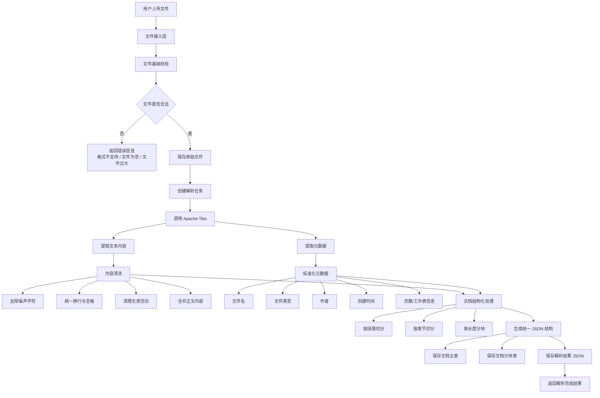
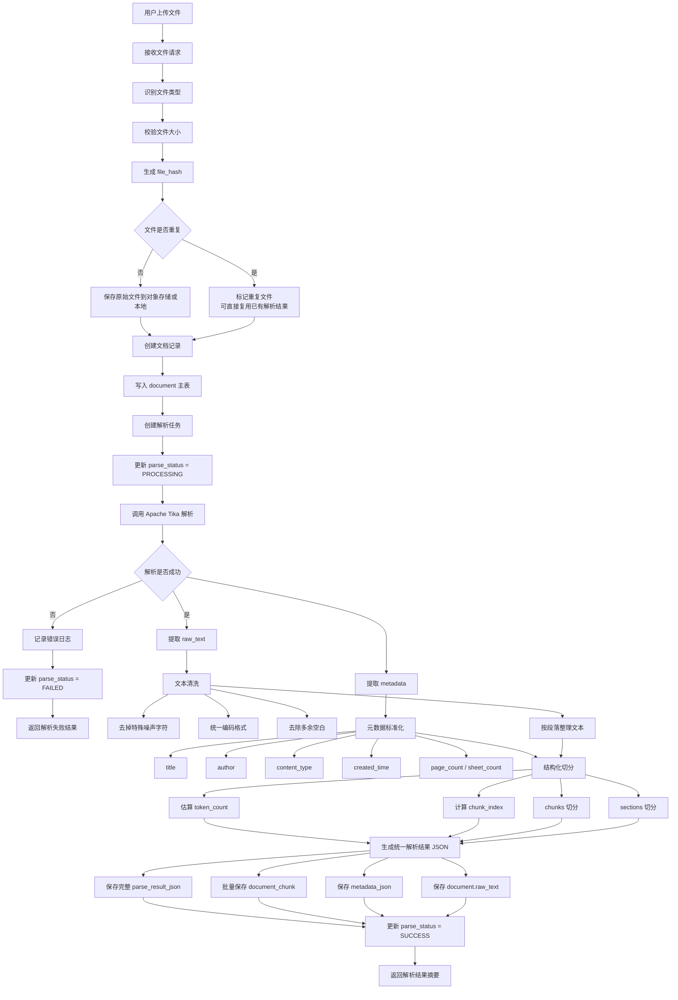
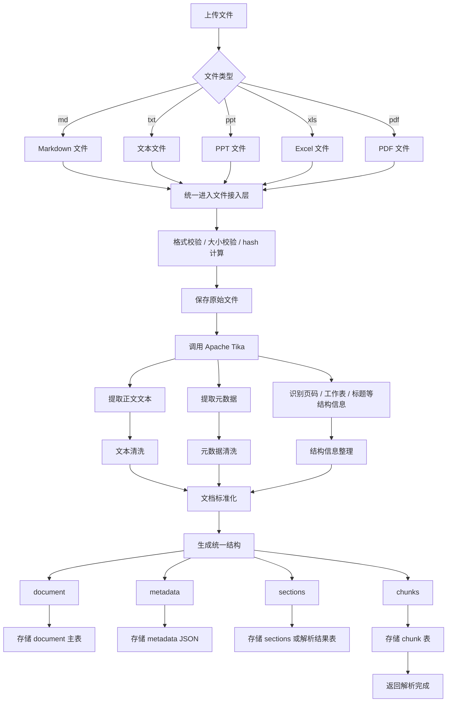

 **文件解析子流程图**链路：

> 文件上传 → 文件接入 → Apache Tika 解析 → 文本与元数据提取 → 内容清洗 → 分段分块 → 结构化存储

两版：

1. **流程版**：适合放在总架构里
2. **细化版**：适合后续按步骤开发

---

# 一、文件解析子流程图（流程简洁版）




---

# 二、文件解析子流程图（细化开发版）

适合你一步一步落地实现，因为它把“异常处理、任务状态、存储结果”拆得更清楚。



---

# 三、突出“支持多文件类型”，可以用这版

强调 Demo 的输入源范围：`md / txt / ppt / xls / pdf`。



---

# 四、我建议你最终采用的“文件解析子流程图”

建议优先用 **第二版“细化开发版”**，因为它最接近真实实现。

## 开发步骤落地

### 第一步：文件接入

先做：

* 上传接口
* 文件格式校验
* 文件大小校验
* 文件 hash 计算
* 原始文件保存

### 第二步：文档记录

再做：

* `document` 主表入库
* 解析任务状态维护

### 第三步：Tika 解析

再做：

* 调用 Tika
* 提取 `raw_text`
* 提取 `metadata`

### 第四步：内容标准化

再做：

* 清洗文本
* 切分 section
* 切分 chunk

### 第五步：结果存储

最后做：

* `document`
* `document_chunk`
* `parse_result_json`
* 更新解析状态

---

# 五、解析结果结构示意

这个可以和流程图配套讲。

```json
{
  "document_id": "DOC_001",
  "file_name": "订单需求说明.pdf",
  "file_type": "pdf",
  "raw_text": "完整解析文本",
  "metadata": {
    "title": "订单需求说明",
    "author": "产品团队",
    "content_type": "application/pdf",
    "created_time": "2026-05-02 10:00:00",
    "page_count": 12
  },
  "sections": [
    {
      "section_index": 1,
      "section_title": "1. 需求背景",
      "content": "章节内容"
    }
  ],
  "chunks": [
    {
      "chunk_id": "CHUNK_001",
      "chunk_index": 1,
      "section_title": "1. 需求背景",
      "chunk_text": "分块文本内容",
      "token_count": 320
    }
  ]
}
```
