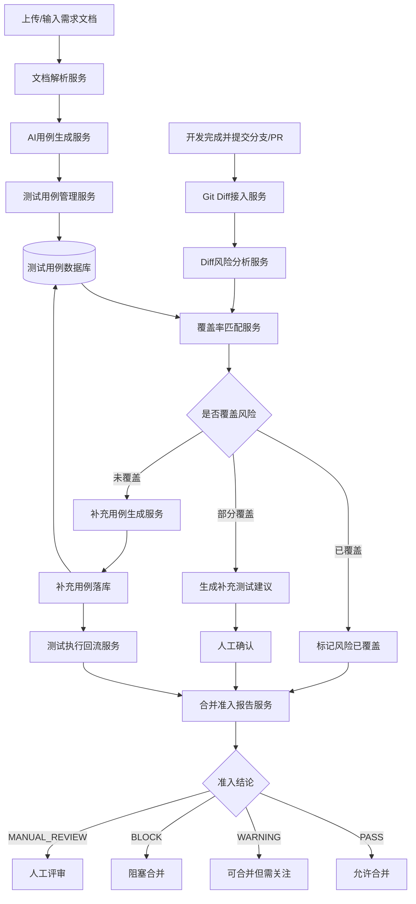
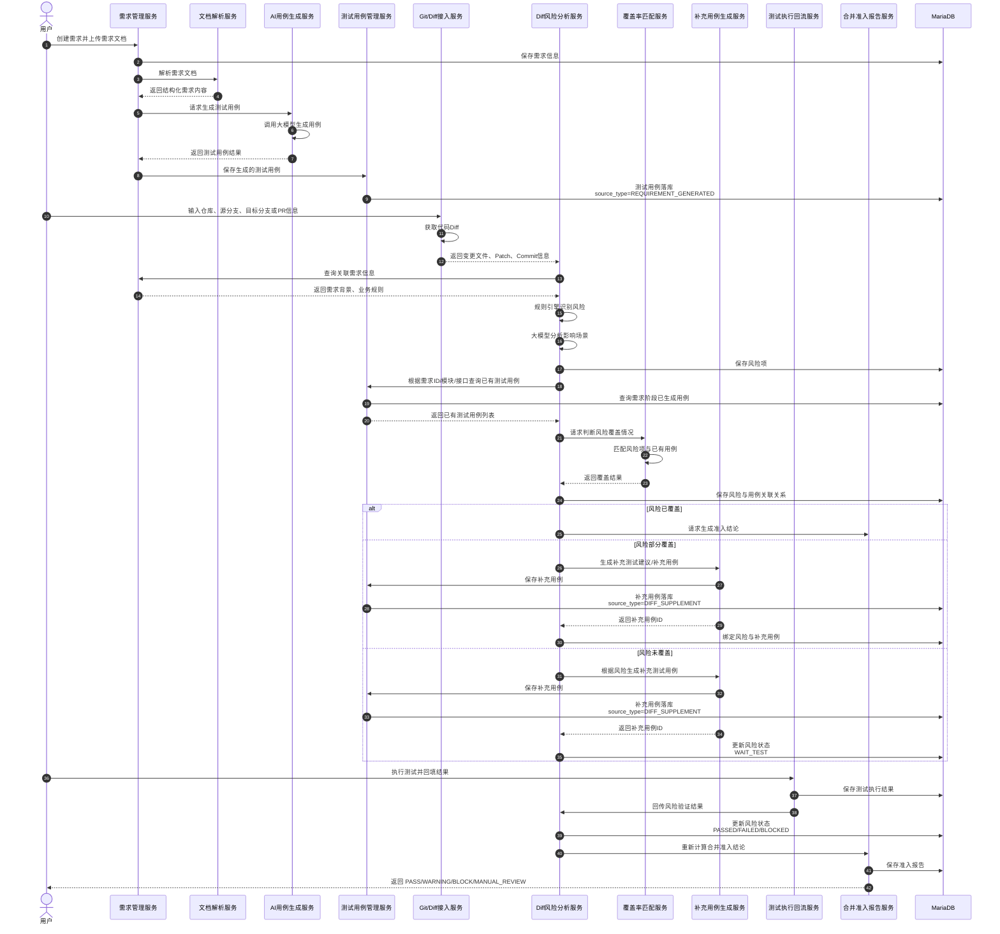
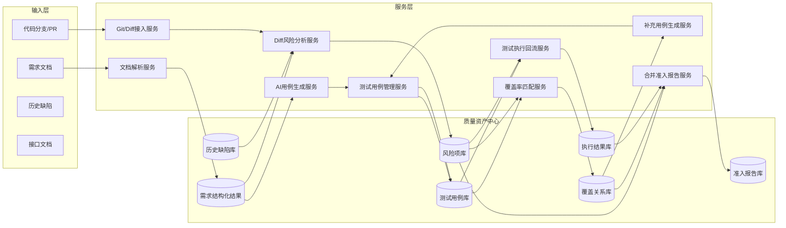

：**Diff 分析不应该孤立成一个“单独功能”，它应该是你整个 AI 测试平台里的一个下游质量分析服务**。

更准确地说，应该从“单点 AI 生成用例”升级成：

> **需求阶段生成测试资产，代码阶段校验测试覆盖，合并阶段形成质量准入。**

所以它不是一个服务自己干完，而是多个服务串起来。

---

# 一、整体服务关系应该这样理解

现在已经有了：

```text
需求文档
  ↓
AI 生成测试用例服务
  ↓
测试用例落库
```

接下来要加的是：

```text
代码 Diff
  ↓
Diff 风险分析服务
  ↓
查询已生成测试用例
  ↓
判断代码变更是否被测试用例覆盖
  ↓
生成风险分析报告
  ↓
未覆盖则补充用例
  ↓
执行验证
  ↓
合并准入
```

所以核心关系是：

```text
AI 用例生成服务  →  测试用例库  →  Diff 风险分析服务
```

Diff 分析服务依赖的不是“重新生成用例”，而是依赖 **AI 用例生成服务沉淀下来的测试资产**。

---

# 二、推荐的服务拆分

把系统拆成这几个服务。

```text
1. 需求管理服务
2. 文档解析服务
3. AI 用例生成服务
4. 测试用例管理服务
5. Git / Diff 接入服务
6. Diff 风险分析服务
7. 覆盖率匹配服务
8. 补充用例生成服务
9. 测试执行回流服务
10. 合并准入报告服务
```

不过第一版不用真的拆成 10 个独立微服务，可以先在一个后端项目里按模块拆清楚。等业务复杂后，再把重点模块独立出去。

---

# 三、每个服务负责什么？

## 1. 需求管理服务

负责管理需求本身。

它保存：

```text
需求ID
需求标题
需求描述
所属项目
所属模块
需求状态
关联文档
关联分支
```

这是整个链路的起点。

---

## 2. 文档解析服务

负责把需求文档解析成结构化内容。

输入：

```text
Word / PDF / Markdown / TXT / 接口文档
```

输出：

```json
{
  "requirement_points": [],
  "business_rules": [],
  "api_list": [],
  "fields": [],
  "exception_scenarios": [],
  "risk_points": []
}
```

---

## 3. AI 用例生成服务

这是你已经做完的核心能力。

它负责：

```text
根据需求文档生成测试用例
```

输出后落库：

```text
测试用例表
测试步骤表
用例与需求关系表
用例标签表
生成记录表
```

这个服务的结果会成为 Diff 分析服务的输入之一。

---

## 4. 测试用例管理服务

这个服务很关键，它不是 AI 服务，但它负责提供“已有用例资产”。

Diff 分析服务后面要通过它查询：

```text
某个需求下有哪些用例？
某个模块下有哪些历史用例？
某个接口有哪些用例？
某个字段有哪些用例？
某类风险有没有已有用例覆盖？
```

所以它需要提供接口，例如：

```http
GET /api/test-cases?requirementId=10001
GET /api/test-cases?moduleId=order
GET /api/test-cases?relatedApi=/api/order/create
GET /api/test-cases?riskTag=幂等
```

---

## 5. Git / Diff 接入服务

负责获取代码变更。

输入：

```text
仓库地址
源分支
目标分支
PR / MR ID
commit hash
```

输出：

```json
{
  "changed_files": [],
  "commits": [],
  "patch": "",
  "diff_summary": ""
}
```

它只负责拿代码变更，不负责判断业务风险。

---

## 6. Diff 风险分析服务

这是你接下来要做的核心服务。

它负责：

```text
根据代码 Diff 分析影响范围和风险点
```

输入包括：

```text
代码 Diff
需求背景
变更文件
变更方法
历史缺陷
业务规则
```

输出：

```text
风险项
影响场景
风险等级
建议测试点
```

注意：这个服务不直接判断“有没有用例覆盖”，它只先把风险识别出来。

---

## 7. 覆盖率匹配服务

这个服务负责把：

```text
Diff 风险项
```

和：

```text
已有测试用例
```

进行匹配。

它判断：

```text
这个风险有没有被已有测试用例覆盖？
是完全覆盖、部分覆盖，还是未覆盖？
```

输出：

```json
{
  "risk_id": 1001,
  "coverage_status": "NOT_COVERED",
  "matched_cases": [],
  "missing_scenarios": [
    "等级等于3的边界场景未覆盖"
  ]
}
```

这一步是工具最有价值的地方。

---

## 8. 补充用例生成服务

只有当风险未覆盖或部分覆盖时，才调用它。

它输入：

```text
风险项
缺失场景
代码变更说明
已有用例
```

输出：

```text
补充测试用例
```

这些补充用例也要落到测试用例库里，并标记来源：

```text
source_type = DIFF_SUPPLEMENT
source_id = risk_id
```

这样以后就知道：

```text
哪些用例是需求阶段生成的？
哪些用例是代码 Diff 阶段补充的？
哪些用例是人工新增的？
```

---

## 9. 测试执行回流服务

负责接收测试结果。

比如：

```text
用例执行通过
用例执行失败
用例阻塞
创建缺陷
关联缺陷单
```

这一步让风险闭环起来。

---

## 10. 合并准入报告服务

最后根据风险状态生成结论：

```text
PASS：允许合并
WARNING：可以合并但建议关注
BLOCK：不建议合并
MANUAL_REVIEW：需要人工评审
```

---

# 四、推荐的完整主流程

现在的完整链路应该是这样：



---

# 五、服务调用时序图

这版更符合“多个服务串起来”。



---

# 六、系统的依赖关系应该这样设计

不是 Diff 服务直接依赖 AI 生成用例服务，而是：

```text
Diff 风险分析服务
    ↓
依赖测试用例管理服务
    ↓
测试用例管理服务的数据来自 AI 用例生成服务
```

也就是说，推荐依赖关系是：

```text
AI 用例生成服务 → 测试用例管理服务 ← Diff 风险分析服务
```

不要设计成：

```text
Diff 风险分析服务 → AI 用例生成服务
```

为什么？

因为 Diff 分析的时候，需要的是“已经生成并确认过的测试用例”，不是重新调用 AI 生成用例。

正确依赖应该是：

```text
Diff 分析服务依赖测试用例资产，而不是直接依赖需求生成流程。
```

只有在发现未覆盖风险时，才需要调用“补充用例生成能力”。

---

# 七、服务边界建议

这样划分边界：

| 服务            |          是否独立 | 职责                       |
| ------------- | ------------: | ------------------------ |
| 需求管理服务        |       可以先作为模块 | 管理需求、关联文档、关联分支           |
| 文档解析服务        |           可独立 | 解析 PDF/Word/Markdown/TXT |
| AI 用例生成服务     |          建议独立 | 根据需求生成测试用例               |
| 测试用例管理服务      |     建议独立或核心模块 | 用例查询、编辑、确认、版本管理          |
| Git/Diff 接入服务 |        建议独立模块 | 获取分支 Diff、PR Diff        |
| Diff 风险分析服务   |          建议独立 | 分析代码变更风险                 |
| 覆盖率匹配服务       |  可作为 Diff 子模块 | 判断风险是否被用例覆盖              |
| 补充用例生成服务      | 可复用 AI 用例生成能力 | 对未覆盖风险生成用例               |
| 测试执行服务        |          后续独立 | 用例执行、结果回流                |
| 准入报告服务        |  可作为 Diff 子模块 | 生成合并准入报告                 |

第一版不要微服务化太重，采用：

```text
一个后端项目
多个业务模块
服务边界先设计清楚
```

例如：

```text
ai-testops-backend
 ├── requirement
 ├── document-parser
 ├── testcase
 ├── ai-generation
 ├── git-diff
 ├── risk-analysis
 ├── coverage
 ├── execution
 └── merge-gate
```

等后面业务复杂后，再拆成独立服务。

---

# 八、关键数据流

要特别关注这个数据链路：

```text
requirement_id
    ↓
generated_case_id
    ↓
diff_task_id
    ↓
risk_id
    ↓
risk_case_relation
    ↓
execution_result
    ↓
merge_gate_report
```

也就是：

```text
需求 → 用例 → 代码风险 → 覆盖关系 → 执行结果 → 准入结论
```

这个链路打通，平台才真正有价值。

---

# 九、最重要的数据库关系

现在已有测试用例表的话，后面最重要的是建立这几种关系。

## 1. 需求和用例关系

```text
requirement_id → case_id
```

表示这些用例是根据某个需求生成的。

---

## 2. Diff 任务和需求关系

```text
diff_task_id → requirement_id
```

表示这次代码变更对应哪个需求。

---

## 3. 风险和用例关系

```text
risk_id → case_id
```

表示这个风险被哪些用例覆盖。

---

## 4. 风险和执行结果关系

```text
risk_id → execution_result_id
```

表示这个风险最终是否验证通过。

---

## 5. Diff 任务和准入报告关系

```text
diff_task_id → merge_gate_report_id
```

表示这次分支是否可以合并。

---

# 十、这里建议加一个“质量资产中心”

为了让服务串得更自然，建议你在产品概念里加一个中间层：

## 质量资产中心

它沉淀这些东西：

```text
需求结构化结果
测试用例
业务规则
风险标签
历史缺陷
接口信息
字段信息
执行结果
```

然后：

```text
AI 用例生成服务
```

负责往质量资产中心写入用例。

```text
Diff 分析服务
```

负责从质量资产中心读取用例、规则、历史缺陷，再生成风险分析。

这样架构就更清晰。

可以理解为：

```text
需求阶段：生产质量资产
代码阶段：消费质量资产并校验覆盖
执行阶段：回流质量资产并持续优化
```

---

# 十一、最终推荐架构图



---

# 十二、现在这句话可以作为产品定位

把这个能力定义成：

> 在需求阶段，平台通过 AI 生成并沉淀测试用例；在代码提交阶段，平台基于分支 Diff 识别代码变更风险，并与已生成测试用例进行覆盖匹配，自动发现测试遗漏场景，生成补充用例和合并准入报告，形成从需求到代码再到测试验证的质量闭环。

这句话非常重要，因为它把两个能力串起来了：

```text
AI 生成用例
+
代码 Diff 风险分析
+
测试覆盖校验
+
合并准入
```

这就不是两个孤立功能，而是一套完整的 AI TestOps 平台能力
