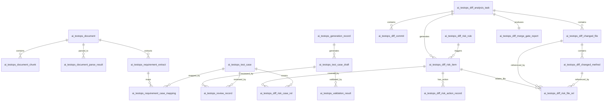

在 **AI 测试设计阶段** 的表，包括文档、解析结果、生成记录、Prompt、需求与用例映射、正式用例、草稿用例、人工评审、校验结果等表。

所以新的 ER 设计不应该重复创建：

```text
ai_testops_document
ai_testops_document_chunk
ai_testops_document_parse_result
ai_testops_generation_record
ai_testops_prompt_template
ai_testops_requirement_case_mapping
ai_testops_requirement_extract
ai_testops_review_record
ai_testops_test_case
ai_testops_test_case_draft
ai_testops_validation_result
```

新模块只需要补充 **代码 Diff 分析、风险识别、风险与用例覆盖关系、风险处理闭环、合并准入报告** 这几类表。

---

# 一、复用已有表后的 ER 设计图



---

# 二、需要新增的表

基于已有的表，建议只新增这 8 张表：

| 新增表名                                 | 作用                |
| ------------------------------------ | ----------------- |
| `ai_testops_diff_analysis_task`      | Diff 分析任务主表       |
| `ai_testops_diff_commit`             | 本次分支 Diff 涉及的提交记录 |
| `ai_testops_diff_changed_file`       | 变更文件表             |
| `ai_testops_diff_changed_method`     | 变更方法/函数表          |
| `ai_testops_diff_risk_rule`          | 风险规则配置表           |
| `ai_testops_diff_risk_item`          | Diff 风险项表         |
| `ai_testops_diff_risk_file_rel`      | 风险与变更文件/方法关联表     |
| `ai_testops_diff_risk_case_rel`      | 风险与已有测试用例/补充用例关联表 |
| `ai_testops_diff_risk_action_record` | 风险处理动作记录表         |
| `ai_testops_diff_merge_gate_report`  | 合并准入报告表           |

严格来说是 10 张表。
如果做 MVP，可以先建 5 张核心表：

```text
ai_testops_diff_analysis_task
ai_testops_diff_changed_file
ai_testops_diff_risk_item
ai_testops_diff_risk_case_rel
ai_testops_diff_merge_gate_report
```

---

# 三、和已有表的复用关系

## 1. 复用正式测试用例表

已有：

```text
ai_testops_test_case
```

新增表里不再创建测试用例主表。

Diff 分析时，通过 `ai_testops_diff_risk_case_rel.case_id` 关联已有正式用例：

```text
ai_testops_diff_risk_item.risk_id
    ↓
ai_testops_diff_risk_case_rel.case_id
    ↓
ai_testops_test_case.id
```

---

## 2. 复用需求与用例映射表

已有：

```text
ai_testops_requirement_case_mapping
```

Diff 分析时，可以通过需求 ID 查询该需求下已经生成的用例：

```text
需求ID
  ↓
ai_testops_requirement_case_mapping
  ↓
ai_testops_test_case
```

所以新的 Diff 表里只需要保存 `requirement_id` 或 `requirement_extract_id`，不要重复设计需求-用例映射表。

---

## 3. 复用需求解析结果表

已有：

```text
ai_testops_requirement_extract
```

Diff 分析时，这张表可以作为需求背景输入：

```text
ai_testops_requirement_extract
  ↓
需求点、业务规则、接口、字段、异常场景
  ↓
Diff 风险分析 Prompt 输入
```

---

## 4. 复用大模型生成记录表

已有：

```text
ai_testops_generation_record
```

如果 Diff 风险分析也调用大模型，建议复用这张表记录 AI 调用过程。

比如可以在 `generation_type` 或类似字段里区分：

```text
REQUIREMENT_CASE_GENERATION
DIFF_RISK_ANALYSIS
DIFF_COVERAGE_JUDGEMENT
DIFF_SUPPLEMENT_CASE_GENERATION
```

如果原表没有这个字段，可以后续加扩展字段，不建议重新建一张生成记录表。

---

# 四、新增表 SQL 设计

下面只给 **新增 Diff 模块相关表**，不重复已经有的表。

---

## 1. Diff 分析任务主表

```sql
CREATE TABLE IF NOT EXISTS ai_testops_diff_analysis_task (
    id BIGINT PRIMARY KEY AUTO_INCREMENT COMMENT '主键ID',
    task_code VARCHAR(64) NOT NULL COMMENT '任务编码',
    document_id BIGINT DEFAULT NULL COMMENT '关联文档ID, 对应 ai_testops_document.id',
    requirement_extract_id BIGINT DEFAULT NULL COMMENT '关联需求解析结果ID, 对应 ai_testops_requirement_extract.id',
    repo_url VARCHAR(500) NOT NULL COMMENT '仓库地址',
    repo_name VARCHAR(255) DEFAULT NULL COMMENT '仓库名称',
    source_branch VARCHAR(255) NOT NULL COMMENT '源分支, 例如 feature/order-cancel',
    target_branch VARCHAR(255) NOT NULL DEFAULT 'master' COMMENT '目标分支, 例如 master/main',
    base_commit VARCHAR(128) DEFAULT NULL COMMENT '目标分支基准提交',
    head_commit VARCHAR(128) DEFAULT NULL COMMENT '源分支最新提交',
    analysis_options JSON DEFAULT NULL COMMENT '分析配置, 例如是否包含测试文件、是否启用AI分析',
    status VARCHAR(32) NOT NULL DEFAULT 'PENDING' COMMENT '任务状态:PENDING/RUNNING/SUCCESS/FAILED/CANCELED',
    fail_reason TEXT DEFAULT NULL COMMENT '失败原因',
    changed_file_count INT NOT NULL DEFAULT 0 COMMENT '变更文件数量',
    changed_method_count INT NOT NULL DEFAULT 0 COMMENT '变更方法数量',
    high_risk_count INT NOT NULL DEFAULT 0 COMMENT '高风险数量',
    medium_risk_count INT NOT NULL DEFAULT 0 COMMENT '中风险数量',
    low_risk_count INT NOT NULL DEFAULT 0 COMMENT '低风险数量',
    not_covered_risk_count INT NOT NULL DEFAULT 0 COMMENT '未覆盖风险数量',
    merge_gate_status VARCHAR(32) DEFAULT NULL COMMENT '准入状态:PASS/WARNING/BLOCK/MANUAL_REVIEW',
    created_by VARCHAR(64) DEFAULT NULL COMMENT '创建人',
    created_at DATETIME NOT NULL DEFAULT CURRENT_TIMESTAMP COMMENT '创建时间',
    updated_by VARCHAR(64) DEFAULT NULL COMMENT '更新人',
    updated_at DATETIME NOT NULL DEFAULT CURRENT_TIMESTAMP ON UPDATE CURRENT_TIMESTAMP COMMENT '更新时间',
    UNIQUE INDEX uk_task_code (task_code),
    INDEX idx_document_id (document_id),
    INDEX idx_requirement_extract_id (requirement_extract_id),
    INDEX idx_repo_branch (repo_name, source_branch, target_branch),
    INDEX idx_status (status),
    INDEX idx_merge_gate_status (merge_gate_status),
    INDEX idx_created_at (created_at)
) ENGINE=InnoDB DEFAULT CHARSET=utf8mb4 COLLATE=utf8mb4_unicode_ci COMMENT='Diff分析任务主表';

```

---

## 2. Diff 提交记录表

```sql
CREATE TABLE IF NOT EXISTS ai_testops_diff_commit (
    id BIGINT PRIMARY KEY AUTO_INCREMENT COMMENT '主键ID',
    task_id BIGINT NOT NULL COMMENT 'Diff分析任务ID',
    commit_hash VARCHAR(128) NOT NULL COMMENT '提交Hash',
    short_hash VARCHAR(32) DEFAULT NULL COMMENT '短提交Hash',
    author_name VARCHAR(128) DEFAULT NULL COMMENT '提交作者',
    author_email VARCHAR(255) DEFAULT NULL COMMENT '作者邮箱',
    commit_message TEXT DEFAULT NULL COMMENT '提交信息',
    commit_time DATETIME DEFAULT NULL COMMENT '提交时间',
    created_at DATETIME NOT NULL DEFAULT CURRENT_TIMESTAMP COMMENT '创建时间',
    UNIQUE INDEX uk_task_commit (task_id, commit_hash),
    INDEX idx_task_id (task_id),
    INDEX idx_commit_hash (commit_hash),
    INDEX idx_commit_time (commit_time)
) ENGINE=InnoDB DEFAULT CHARSET=utf8mb4 COLLATE=utf8mb4_unicode_ci COMMENT='Diff分析提交记录表';
```

---

## 3. Diff 变更文件表

```sql
CREATE TABLE IF NOT EXISTS ai_testops_diff_changed_file (
    id BIGINT PRIMARY KEY AUTO_INCREMENT COMMENT '主键ID',
    task_id BIGINT NOT NULL COMMENT 'Diff分析任务ID',
    old_file_path VARCHAR(1000) DEFAULT NULL COMMENT '旧文件路径, 重命名场景使用',
    new_file_path VARCHAR(1000) NOT NULL COMMENT '新文件路径',
    change_type VARCHAR(32) NOT NULL COMMENT '变更类型:ADDED/MODIFIED/DELETED/RENAMED',
    language VARCHAR(64) DEFAULT NULL COMMENT '代码语言:JAVA/PYTHON/JS/SQL/YAML等',
    file_role VARCHAR(64) DEFAULT NULL COMMENT '文件角色:CONTROLLER/SERVICE/DAO/CONFIG/SQL/TEST/OTHER',
    additions INT NOT NULL DEFAULT 0 COMMENT '新增行数',
    deletions INT NOT NULL DEFAULT 0 COMMENT '删除行数',
    changes INT NOT NULL DEFAULT 0 COMMENT '总变更行数',
    patch MEDIUMTEXT DEFAULT NULL COMMENT 'Diff Patch内容',
    patch_summary TEXT DEFAULT NULL COMMENT 'Diff摘要',
    is_test_file TINYINT NOT NULL DEFAULT 0 COMMENT '是否测试文件:0否,1是',
    is_core_file TINYINT NOT NULL DEFAULT 0 COMMENT '是否核心文件:0否,1是',
    initial_risk_level VARCHAR(32) DEFAULT NULL COMMENT '规则初判风险等级:HIGH/MEDIUM/LOW',
    initial_risk_reason TEXT DEFAULT NULL COMMENT '规则初判风险原因',
    created_at DATETIME NOT NULL DEFAULT CURRENT_TIMESTAMP COMMENT '创建时间',
    INDEX idx_task_id (task_id),
    INDEX idx_new_file_path (new_file_path(255)),
    INDEX idx_file_role (file_role),
    INDEX idx_change_type (change_type),
    INDEX idx_initial_risk_level (initial_risk_level),
    INDEX idx_is_test_file (is_test_file),
    INDEX idx_is_core_file (is_core_file)
) ENGINE=InnoDB DEFAULT CHARSET=utf8mb4 COLLATE=utf8mb4_unicode_ci COMMENT='Diff变更文件表';
```

---

## 4. Diff 变更方法表

```sql
CREATE TABLE IF NOT EXISTS ai_testops_diff_changed_method (
    id BIGINT PRIMARY KEY AUTO_INCREMENT COMMENT '主键ID',
    task_id BIGINT NOT NULL COMMENT 'Diff分析任务ID',
    changed_file_id BIGINT NOT NULL COMMENT '变更文件ID',
    class_name VARCHAR(255) DEFAULT NULL COMMENT '类名',
    method_name VARCHAR(255) DEFAULT NULL COMMENT '方法/函数名称',
    method_signature VARCHAR(1000) DEFAULT NULL COMMENT '方法签名',
    change_type VARCHAR(32) NOT NULL COMMENT '变更类型:ADDED/MODIFIED/DELETED',
    start_line INT DEFAULT NULL COMMENT '方法起始行',
    end_line INT DEFAULT NULL COMMENT '方法结束行',
    changed_lines JSON DEFAULT NULL COMMENT '变更行号列表',
    method_role VARCHAR(255) DEFAULT NULL COMMENT '方法语义角色, 例如订单创建、奖励发放、权限校验',
    method_summary TEXT DEFAULT NULL COMMENT '方法变更摘要',
    risk_tags JSON DEFAULT NULL COMMENT '风险标签, 例如状态流转、金额计算、权限校验',
    created_at DATETIME NOT NULL DEFAULT CURRENT_TIMESTAMP COMMENT '创建时间',
    INDEX idx_task_id (task_id),
    INDEX idx_changed_file_id (changed_file_id),
    INDEX idx_method_name (method_name),
    INDEX idx_change_type (change_type)
) ENGINE=InnoDB DEFAULT CHARSET=utf8mb4 COLLATE=utf8mb4_unicode_ci COMMENT='Diff变更方法表';
```

---

## 5. Diff 风险规则表

```sql
CREATE TABLE IF NOT EXISTS ai_testops_diff_risk_rule (
    id BIGINT PRIMARY KEY AUTO_INCREMENT COMMENT '主键ID',
    rule_code VARCHAR(64) NOT NULL COMMENT '规则编码',
    rule_name VARCHAR(255) NOT NULL COMMENT '规则名称',
    rule_category VARCHAR(64) NOT NULL COMMENT '规则类别:FILE_PATH/FILE_ROLE/KEYWORD/CHANGE_SIZE/CUSTOM',
    match_type VARCHAR(64) NOT NULL COMMENT '匹配类型:CONTAINS/REGEX/EQUALS/GREATER_THAN/CUSTOM',
    match_pattern VARCHAR(1000) NOT NULL COMMENT '匹配表达式',
    risk_level VARCHAR(32) NOT NULL COMMENT '风险等级:HIGH/MEDIUM/LOW',
    risk_category VARCHAR(64) NOT NULL COMMENT '风险分类:接口兼容/业务逻辑/数据一致性/权限/配置等',
    risk_desc TEXT NOT NULL COMMENT '风险描述',
    suggestion TEXT DEFAULT NULL COMMENT '测试建议',
    priority INT NOT NULL DEFAULT 100 COMMENT '规则优先级, 数字越小优先级越高',
    enabled TINYINT NOT NULL DEFAULT 1 COMMENT '是否启用:0否,1是',
    created_by VARCHAR(64) DEFAULT NULL COMMENT '创建人',
    created_at DATETIME NOT NULL DEFAULT CURRENT_TIMESTAMP COMMENT '创建时间',
    updated_by VARCHAR(64) DEFAULT NULL COMMENT '更新人',
    updated_at DATETIME NOT NULL DEFAULT CURRENT_TIMESTAMP ON UPDATE CURRENT_TIMESTAMP COMMENT '更新时间',
    UNIQUE INDEX uk_rule_code (rule_code),
    INDEX idx_rule_category (rule_category),
    INDEX idx_risk_level (risk_level),
    INDEX idx_enabled (enabled)
) ENGINE=InnoDB DEFAULT CHARSET=utf8mb4 COLLATE=utf8mb4_unicode_ci COMMENT='Diff风险规则配置表';
```

---

## 6. Diff 风险项表

```sql
CREATE TABLE IF NOT EXISTS ai_testops_diff_risk_item (
    id BIGINT PRIMARY KEY AUTO_INCREMENT COMMENT '主键ID',
    task_id BIGINT NOT NULL COMMENT 'Diff分析任务ID',
    document_id BIGINT DEFAULT NULL COMMENT '关联文档ID, 对应 ai_testops_document.id',
    requirement_extract_id BIGINT DEFAULT NULL COMMENT '关联需求解析结果ID, 对应 ai_testops_requirement_extract.id',
    risk_code VARCHAR(64) NOT NULL COMMENT '风险编码',
    risk_title VARCHAR(255) NOT NULL COMMENT '风险标题',
    risk_level VARCHAR(32) NOT NULL COMMENT '风险等级:HIGH/MEDIUM/LOW',
    risk_category VARCHAR(64) NOT NULL COMMENT '风险分类:接口兼容/业务逻辑/边界值/权限/数据一致性/配置/性能/幂等/兼容性/其他',
    source_type VARCHAR(32) NOT NULL COMMENT '风险来源:RULE/AI/MANUAL',
    source_rule_code VARCHAR(64) DEFAULT NULL COMMENT '来源规则编码',
    affected_module VARCHAR(255) DEFAULT NULL COMMENT '影响模块',
    affected_scenarios JSON DEFAULT NULL COMMENT '影响场景列表',
    risk_reason TEXT DEFAULT NULL COMMENT '风险原因',
    test_suggestion TEXT DEFAULT NULL COMMENT '测试建议',
    missing_test_scenarios JSON DEFAULT NULL COMMENT '缺失测试场景',
    ai_confidence DECIMAL(5,2) DEFAULT NULL COMMENT 'AI判断置信度, 0-100',
    coverage_status VARCHAR(32) NOT NULL DEFAULT 'NEED_CONFIRM' COMMENT '覆盖状态:COVERED/PARTIAL_COVERED/NOT_COVERED/NEED_CONFIRM',
    coverage_reason TEXT DEFAULT NULL COMMENT '覆盖判断原因',
    process_status VARCHAR(32) NOT NULL DEFAULT 'PENDING' COMMENT '处理状态:PENDING/CONFIRMED/IGNORED/WAIT_CASE/WAIT_TEST/TESTING/PASSED/FAILED/BLOCKED/CLOSED',
    merge_gate_impact VARCHAR(32) NOT NULL DEFAULT 'WARNING' COMMENT '准入影响:PASS/WARNING/BLOCK/MANUAL_REVIEW',
    ignore_reason VARCHAR(1000) DEFAULT NULL COMMENT '忽略原因',
    owner VARCHAR(64) DEFAULT NULL COMMENT '风险处理负责人',
    created_by VARCHAR(64) DEFAULT NULL COMMENT '创建人',
    created_at DATETIME NOT NULL DEFAULT CURRENT_TIMESTAMP COMMENT '创建时间',
    updated_by VARCHAR(64) DEFAULT NULL COMMENT '更新人',
    updated_at DATETIME NOT NULL DEFAULT CURRENT_TIMESTAMP ON UPDATE CURRENT_TIMESTAMP COMMENT '更新时间',
    UNIQUE INDEX uk_task_risk_code (task_id, risk_code),
    INDEX idx_task_id (task_id),
    INDEX idx_document_id (document_id),
    INDEX idx_requirement_extract_id (requirement_extract_id),
    INDEX idx_risk_level (risk_level),
    INDEX idx_risk_category (risk_category),
    INDEX idx_coverage_status (coverage_status),
    INDEX idx_process_status (process_status),
    INDEX idx_merge_gate_impact (merge_gate_impact)
) ENGINE=InnoDB DEFAULT CHARSET=utf8mb4 COLLATE=utf8mb4_unicode_ci COMMENT='Diff风险项表';
```

---

## 7. 风险与变更文件关联表

```sql
CREATE TABLE IF NOT EXISTS ai_testops_diff_risk_file_rel (
    id BIGINT PRIMARY KEY AUTO_INCREMENT COMMENT '主键ID',
    risk_id BIGINT NOT NULL COMMENT '风险ID',
    changed_file_id BIGINT NOT NULL COMMENT '变更文件ID',
    changed_method_id BIGINT DEFAULT NULL COMMENT '变更方法ID',
    relation_reason TEXT DEFAULT NULL COMMENT '关联原因',
    created_at DATETIME NOT NULL DEFAULT CURRENT_TIMESTAMP COMMENT '创建时间',
    INDEX idx_risk_id (risk_id),
    INDEX idx_changed_file_id (changed_file_id),
    INDEX idx_changed_method_id (changed_method_id)
) ENGINE=InnoDB DEFAULT CHARSET=utf8mb4 COLLATE=utf8mb4_unicode_ci COMMENT='Diff风险与变更文件关联表';
```

---

## 8. 风险与测试用例覆盖关系表

这张表是新模块和已有 `ai_testops_test_case` 的关键连接点。

```sql
CREATE TABLE IF NOT EXISTS ai_testops_diff_risk_case_rel (
    id BIGINT PRIMARY KEY AUTO_INCREMENT COMMENT '主键ID',
    risk_id BIGINT NOT NULL COMMENT '风险ID',
    case_id BIGINT NOT NULL COMMENT '测试用例ID, 对应 ai_testops_test_case.id',
    document_id BIGINT DEFAULT NULL COMMENT '关联文档ID, 对应 ai_testops_document.id',
    requirement_extract_id BIGINT DEFAULT NULL COMMENT '关联需求解析结果ID, 对应 ai_testops_requirement_extract.id',
    case_source_type VARCHAR(64) DEFAULT NULL COMMENT '用例来源:REQUIREMENT_GENERATED/DIFF_SUPPLEMENT/MANUAL/HISTORY',
    relation_type VARCHAR(64) NOT NULL COMMENT '关联类型:EXISTING_REQUIREMENT_CASE/EXISTING_HISTORY_CASE/GENERATED_SUPPLEMENT_CASE/MANUAL_LINKED_CASE',
    coverage_judgement VARCHAR(32) NOT NULL COMMENT '覆盖判断:COVERED/PARTIAL/NOT_MATCHED',
    judgement_reason TEXT DEFAULT NULL COMMENT '判断原因',
    similarity_score DECIMAL(6,4) DEFAULT NULL COMMENT '相似度分数, 0-1',
    generated_from_ai TINYINT NOT NULL DEFAULT 0 COMMENT '是否AI生成:0否,1是',
    created_by VARCHAR(64) DEFAULT NULL COMMENT '创建人',
    created_at DATETIME NOT NULL DEFAULT CURRENT_TIMESTAMP COMMENT '创建时间',
    UNIQUE INDEX uk_risk_case (risk_id, case_id),
    INDEX idx_risk_id (risk_id),
    INDEX idx_case_id (case_id),
    INDEX idx_document_id (document_id),
    INDEX idx_requirement_extract_id (requirement_extract_id),
    INDEX idx_case_source_type (case_source_type),
    INDEX idx_relation_type (relation_type),
    INDEX idx_coverage_judgement (coverage_judgement)
) ENGINE=InnoDB DEFAULT CHARSET=utf8mb4 COLLATE=utf8mb4_unicode_ci COMMENT='Diff风险与测试用例覆盖关系表';
```

---

## 9. 风险处理动作记录表

```sql
CREATE TABLE IF NOT EXISTS ai_testops_diff_risk_action_record (
    id BIGINT PRIMARY KEY AUTO_INCREMENT COMMENT '主键ID',
    risk_id BIGINT NOT NULL COMMENT '风险ID',
    task_id BIGINT NOT NULL COMMENT 'Diff分析任务ID',
    action_type VARCHAR(64) NOT NULL COMMENT '动作类型:CONFIRM/IGNORE/GENERATE_CASE/LINK_CASE/CREATE_TASK/START_TEST/MARK_PASS/MARK_FAIL/MARK_BLOCKED/CREATE_BUG/CLOSE/REOPEN',
    before_status VARCHAR(32) DEFAULT NULL COMMENT '操作前状态',
    after_status VARCHAR(32) DEFAULT NULL COMMENT '操作后状态',
    action_desc TEXT DEFAULT NULL COMMENT '动作说明',
    action_payload JSON DEFAULT NULL COMMENT '动作扩展信息, 例如关联用例、缺陷ID、执行结果等',
    operator VARCHAR(64) DEFAULT NULL COMMENT '操作人',
    created_at DATETIME NOT NULL DEFAULT CURRENT_TIMESTAMP COMMENT '创建时间',
    INDEX idx_risk_id (risk_id),
    INDEX idx_task_id (task_id),
    INDEX idx_action_type (action_type),
    INDEX idx_created_at (created_at)
) ENGINE=InnoDB DEFAULT CHARSET=utf8mb4 COLLATE=utf8mb4_unicode_ci COMMENT='Diff风险处理动作记录表';
```

---

## 10. 合并准入报告表

```sql
CREATE TABLE IF NOT EXISTS ai_testops_diff_merge_gate_report (
    id BIGINT PRIMARY KEY AUTO_INCREMENT COMMENT '主键ID',
    task_id BIGINT NOT NULL COMMENT 'Diff分析任务ID',
    report_code VARCHAR(64) NOT NULL COMMENT '报告编码',
    gate_status VARCHAR(32) NOT NULL COMMENT '准入状态:PASS/WARNING/BLOCK/MANUAL_REVIEW',
    gate_reason TEXT DEFAULT NULL COMMENT '准入原因',
    changed_file_count INT NOT NULL DEFAULT 0 COMMENT '变更文件数量',
    changed_method_count INT NOT NULL DEFAULT 0 COMMENT '变更方法数量',
    high_risk_count INT NOT NULL DEFAULT 0 COMMENT '高风险数量',
    medium_risk_count INT NOT NULL DEFAULT 0 COMMENT '中风险数量',
    low_risk_count INT NOT NULL DEFAULT 0 COMMENT '低风险数量',
    covered_risk_count INT NOT NULL DEFAULT 0 COMMENT '已覆盖风险数量',
    partial_covered_risk_count INT NOT NULL DEFAULT 0 COMMENT '部分覆盖风险数量',
    not_covered_risk_count INT NOT NULL DEFAULT 0 COMMENT '未覆盖风险数量',
    need_confirm_risk_count INT NOT NULL DEFAULT 0 COMMENT '待确认风险数量',
    blocked_risk_count INT NOT NULL DEFAULT 0 COMMENT '阻塞风险数量',
    suggested_case_count INT NOT NULL DEFAULT 0 COMMENT '建议补充用例数量',
    suggested_regression_modules JSON DEFAULT NULL COMMENT '建议回归模块列表',
    report_summary TEXT DEFAULT NULL COMMENT '报告摘要',
    report_detail JSON DEFAULT NULL COMMENT '报告详情',
    created_by VARCHAR(64) DEFAULT NULL COMMENT '创建人',
    created_at DATETIME NOT NULL DEFAULT CURRENT_TIMESTAMP COMMENT '创建时间',
    UNIQUE INDEX uk_report_code (report_code),
    UNIQUE INDEX uk_task_id (task_id),
    INDEX idx_gate_status (gate_status),
    INDEX idx_created_at (created_at)
) ENGINE=InnoDB DEFAULT CHARSET=utf8mb4 COLLATE=utf8mb4_unicode_ci COMMENT='Diff合并准入报告表';
```

---

# 五、调整后的完整数据链路

## 1. 需求阶段：复用已有表

```text
ai_testops_document
    ↓
ai_testops_document_parse_result
    ↓
ai_testops_requirement_extract
    ↓
ai_testops_generation_record
    ↓
ai_testops_test_case_draft
    ↓
ai_testops_review_record
    ↓
ai_testops_test_case
    ↓
ai_testops_requirement_case_mapping
```

---

## 2. 代码阶段：新增 Diff 表

```text
ai_testops_diff_analysis_task
    ↓
ai_testops_diff_changed_file
    ↓
ai_testops_diff_changed_method
    ↓
ai_testops_diff_risk_item
```

---

## 3. 覆盖匹配：连接已有测试用例

```text
ai_testops_diff_risk_item
    ↓
ai_testops_diff_risk_case_rel
    ↓
ai_testops_test_case
```

---

## 4. 风险闭环：新增风险处理与准入表

```text
ai_testops_diff_risk_item
    ↓
ai_testops_diff_risk_action_record
    ↓
ai_testops_diff_merge_gate_report
```

---

# 六、你现在最应该关注的 3 张新增表

如果要先做开发，建议先实现这 3 张：

```text
ai_testops_diff_analysis_task
ai_testops_diff_risk_item
ai_testops_diff_risk_case_rel
```

原因：

| 表                               | 价值                    |
| ------------------------------- | --------------------- |
| `ai_testops_diff_analysis_task` | 记录一次分支 Diff 分析任务      |
| `ai_testops_diff_risk_item`     | 保存代码变更识别出的风险          |
| `ai_testops_diff_risk_case_rel` | 把风险和已有测试用例关联起来，判断是否覆盖 |

这三张表一落地，主链路就能跑通：

```text
输入分支
  ↓
生成风险
  ↓
查询 ai_testops_test_case
  ↓
写入 ai_testops_diff_risk_case_rel
  ↓
输出覆盖结论
```

---

# 七、最终结论

原来的 **AI 生成测试用例相关表不用重建**，应该全部复用。
新的 ER 设计只补充 **Diff 分析域**：

```text
Diff分析任务
Diff提交记录
Diff变更文件
Diff变更方法
风险规则
风险项
风险-文件关系
风险-用例覆盖关系
风险处理记录
合并准入报告
```

其中最关键的是：

```text
ai_testops_diff_risk_case_rel
```

新 Diff 模块和已有 `ai_testops_test_case` 的桥梁，也是这个系统从“AI 生成用例”升级为“代码变更覆盖校验”的核心连接表。
