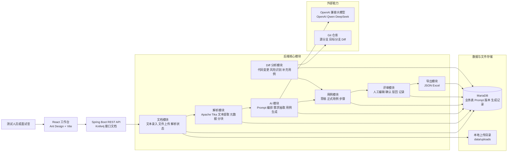
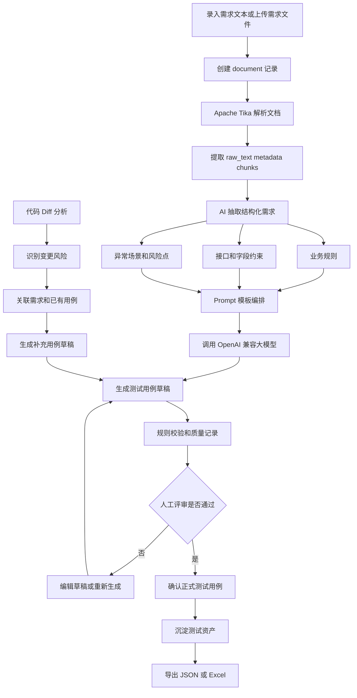

# AI TestOps 项目架构介绍图

## 现有流程图位置

当前项目已经有多份 Mermaid 图，但偏细分模块：

- 主业务流程图：[AI 根据需求文档生成测试用例.md/Mermaid 格式流程图.md](./AI%20根据需求文档生成测试用例.md/Mermaid%20格式流程图.md)
- 前端页面交互流程图：[AI 根据需求文档生成测试用例.md/前端页面交互流程图.md](./AI%20根据需求文档生成测试用例.md/前端页面交互流程图.md)
- 文件解析子流程图：[AI 根据需求文档生成测试用例.md/文件解析子流程图.md](./AI%20根据需求文档生成测试用例.md/文件解析子流程图.md)
- Diff 分析主流程图：[Diff 分析模块/Diff 分析主流程时序图.md](./Diff%20分析模块/Diff%20分析主流程时序图.md)
- 数据库存储 ER 图：[AI 根据需求文档生成测试用例.md/数据库存储 ER 设计.md](./AI%20根据需求文档生成测试用例.md/数据库存储%20ER%20设计.md)

下面这张图更适合面试时作为项目总览介绍。

## VS Code 预览说明

如果使用 VS Code 的 Markdown 预览，请打开本文件后执行 `Markdown: Open Preview to the Side`。

如果使用 Mermaid 插件的 Mermaid Preview，请打开纯 Mermaid 文件：

- [架构图/项目总架构图.mmd](./架构图/项目总架构图.mmd)
- [架构图/核心业务流转图.mmd](./架构图/核心业务流转图.mmd)

不要把整篇 `.md` 文档直接交给 Mermaid Preview 解析；Mermaid Preview 通常要求文件第一行就是 `graph`、`flowchart`、`sequenceDiagram` 等图表声明。

## 项目总架构图

## 核心业务流转图

## 面试讲解口径

这个项目可以按一句话介绍：

> AI TestOps 是一个面向测试设计场景的全链路平台，把需求文档接入、文档解析、AI 需求抽取、测试用例生成、自动校验、人工确认和用例导出串成闭环，同时扩展了代码 Diff 风险分析，用来把需求、代码变更和测试资产关联起来。

讲架构时可以按三层展开：

1. 前端层：React + Ant Design 做测试工作台，覆盖输入材料、文档解析、AI 生成、人工确认、保存导出和 Diff 分析。
2. 服务层：Spring Boot 拆成 document、parser、ai、testcase、review、export、diff 等业务模块，接口通过 Knife4j 管理。
3. 基础能力层：MariaDB 存储业务数据和 AI 生成记录，Apache Tika 负责多格式文档解析，OpenAI 兼容接口负责大模型能力，上传文件落到本地目录。

面试时建议重点强调两个闭环：

- 需求到用例闭环：需求文档进入系统后，解析成文本和分块，再由 AI 抽取结构化需求，生成草稿，经过规则校验和人工确认后沉淀为正式测试用例。
- 变更到补充用例闭环：代码 Diff 分析识别变更风险，关联已有需求和测试用例，对覆盖不足的风险生成补充测试用例草稿。
